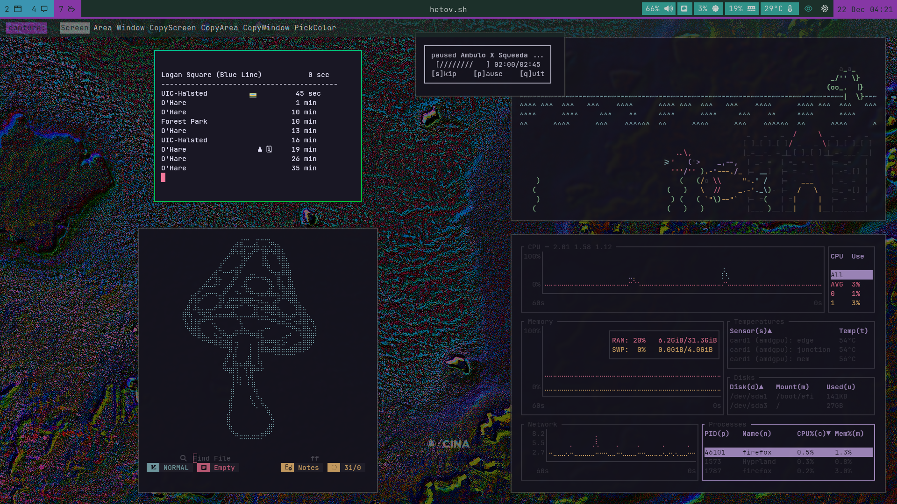

# Dots

My dot files for my Arch Linux + Hyprland setup. 

*Main Applications*

- WM: Hyprland
- Bar: Waybar
- Terminal: Kitty
- Notifications: Mako
- File Manager: Yazi
- Wallpaper: Swww & Pywal
- Editor: Nvim

### Themes

Waybar, mako and other app color themes can be quickly swapped through pywal + [some](scripts/bin/theme.sh) [bash](scripts/bin/post-theme.sh) [scripts](scripts/bin/theme-variant.sh).

To set a theme, start by picking a background using `SUPER+ALT T`. This launches a tofi menu of all images in `~/Wallpaper`. Pywal is use the generate color schemes, but not immedietly set the wallpaper. After the [theme-post.sh](scripts/bin/theme-post.sh) configures 

Custom pywal [template](wal/dot-config/wal/templates) are used to integrate with hyprland, hyprlock, hyprpaper, mako and tofi.

I do not allow pywal to set terminal color schemes. Instead the kitty theme is set to match my current NVChad theme through the [poes.sh](scripts/bin/poes.sh) script.

### Screen Shots

### Keybinds

##

*Launchers*

| Modifiers | Key | Description | App |
| --------- | --- | ----------- | --- |
| SUPER | RETURN | Launch terminal | Kitty |
| SUPER | E | Launch file manager | Yazi |
| SUPER ALT | E | Launch graphical file manager | Dolphin |
| SUPER | B | Launch browser | Firefox |
| SUPER ALT | B | Launch alternate browser | Qutebrowser |
| SUPER | SPACE | App launcher | Tofi |
| SUPER SHIFT | Q | Kill active | |
| SUPER SHIFT | P | Power menu | Tofi |
| SUPER SHIFT | X | Screenshot menu | Tofi |
| SUPER SHIFT | E | Emoji picker | Tofi |
| SUPER | M | Launch Spotify player | ncspot |
| SUPER ALT | M | Launch lowfi music player | lowfi |
| SUPER ALT | U | System update | pacman |

*Windows*

| Modifiers | Key | Description |
| --------- | --- | ----------- |
| SUPER | F | Toggle fullscreen |
| SUPER SHIFT | F | Toggle floating |
| SUPER SHIFT ALT | F | Full Fullscreen |
| SUPER ALT | P | Toggle pseudo |
| SUPER ALT | J | Change split |
| SUPER ALT | R | Promote to root |
| SUPER | L Mouse | Move window |
| SUPER | R Mouse | Resize window |

*Movement*

| Modifiers | Key | Description |
| --------- | --- | ----------- |
| SUPER | H/J/K/L | Move focus |
| SUPER | Arrow | Move focus |
| SUPER SHIFT | H/J/K/L | Move window |
| SUPER SHIFT | Arrow | Move window |
| CTRL SUPER SHIFT | H/L | Move workspace monitor |
| SUPER | Tab | Cycle window focus |

*Workspaces*

| Modifiers | Key | Description |
| --------- | --- | ----------- |
| SUPER | {1...0} | Goto workspace |
| SUPER SHIFT | {1...0} | Move to workspace |
| SUPER ALT SHIFT | W | Toggle workspace floating |
| SUPER | Mouse Wheel | Cycle workspaces |
| SUPER | S | View scratchpad |
| SUPER SHIFT | S | Send to scratchpad |

### Stow

I use gnu `stow` to manage configs. This repo is placed in my home folder. Note that each application module uses `dot-config` directory, as opposed to `.config`. This is configured through the `--dotfiles` flag in `.stowrc`. 

